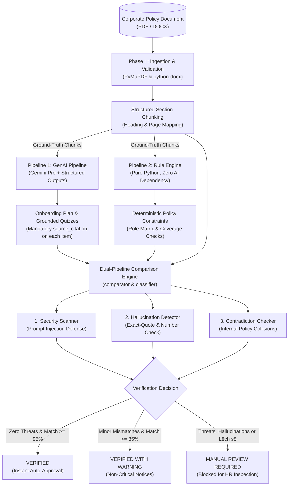

# SkillSprint AI — Dual-Pipeline AI Document Verification System

[](https://www.python.org/)
[](tests/)
[](#core-architecture-dual-pipeline)
[](https://techwiz.fpt.edu.vn/)

> **Team:** Four Angry Birds  
> **Competition:** TechWiz 7 — Generative AI Powerplay Track  
> **Core Mission:** Eliminate enterprise onboarding overhead while providing a 100% mathematically verifiable shield against AI hallucinations and malicious prompt injections.

---

## 📌 Executive Summary

Enterprise employee onboarding is historically slow, fragmented, and resource-intensive. While generative AI (LLMs) can automate personalized curriculum generation, deploying raw LLM outputs in corporate and legal environments introduces catastrophic risks:

1. **AI Hallucinations:** Large language models routinely fabricate non-existent employee perks, alter leave entitlement figures, or generate invalid compliance instructions.
2. **Adversarial Injections:** Malicious inputs inside uploaded documents (`SYSTEM OVERRIDE`, jailbreak prompts) can hijack the LLM to auto-approve unverified content.
3. **Internal Policy Contradictions:** Multi-page corporate handbooks often contain conflicting clauses written at different times (e.g., password expiry in 90 days vs. 30 days).

**SkillSprint AI** resolves these fundamental challenges through a **Dual-Pipeline Architecture**: pairing an advanced Generative AI generation pipeline with an independent, pure-Python deterministic Rule Engine that validates every claim against ground-truth source chunks.

---

## 🏛️ Core Architecture: Dual-Pipeline



---

## 🚀 Key Engineering Innovations

| Feature | Technical Implementation | Benefit |
| :--- | :--- | :--- |
| **Pure Python Rule Engine** | Standard library + regex only (zero AI SDKs). | 100% deterministic ground-truth unaffected by LLM drift or API downtime. |
| **Strict Citation Enforcement** | Pydantic v2 schemas requiring `exact_quote` and `page_number` for every task and quiz. | Eliminates unsubstantiated claims; makes every output traceable to source pages. |
| **Number Tampering Defense** | RegEx extraction `\b\d+\b` comparing claimed numbers against source text. | Catches altered metrics (e.g., 15 leave days altered to 30) even when sentence structure matches. |
| **Prompt Injection Neutralization** | Pattern-based scanner intercepting `SYSTEM OVERRIDE`, `DAN`, `Ignore prior instructions`. | Shields the enterprise from prompt-leakage and jailbreak attacks before processing. |
| **Contradiction Collision Engine** | Cross-clause regex matcher extracting numerical constraints per policy topic. | Automatically flags internal handbook collisions (e.g., password expiration mismatch). |
| **Autonomous Hidden Test Ready** | Fully automated runner (`hidden_test_ready/run_hidden_test.py`). | Ingests and verifies completely unseen documents without manual intervention. |

---

## 🛠️ Tech Stack & Requirements

- **Runtime:** Python 3.10+ (Tested on Python 3.10, 3.11, 3.12, 3.13, 3.14)
- **Document Ingestion:** PyMuPDF (`fitz`), `python-docx`
- **Generative AI:** Google Gemini Pro (`gemini-flash-lite-latest` / `gemini-pro`)
- **Data Validation & Schemas:** Pydantic v2, Pydantic-Settings
- **Rule Engine (Pipeline 2):** `src/python_validation/` — CSV-driven Role Requirement Matrix,
  Coverage Scorer, Prerequisite Checker (pure Python, zero AI SDK imports)
- **Security & Integrity:** Regex-based Injection Filter, SHA-256 Document Hashing
- **Testing & QA:** Pytest + Coverage (64 automated tests, 100% pass rate, 90% line coverage)

---

## ⚙️ Step-by-Step Installation & Setup

### 1. Clone Repository & Setup Virtual Environment
```bash
# Clone the repository
git clone https://github.com/LamPhongG/TechWiz7-FourAngryBirds-SkillSprint-AI.git
cd TechWiz7-FourAngryBirds-SkillSprint-AI

# Create virtual environment
python -m venv venv

# Activate virtual environment
# Windows PowerShell:
.\venv\Scripts\Activate.ps1
# Linux / macOS:
source venv/bin/activate
```

### 2. Install Dependencies
```bash
pip install -r requirements.txt
```

### 3. Configure Environment Variables
Copy `.env.example` to `.env` and fill in your Gemini API Key:
```bash
# Windows:
copy .env.example .env
# Linux / macOS:
cp .env.example .env
```
Inside `.env`:
```ini
GEMINI_API_KEY=your_gemini_api_key_here
GEMINI_MODEL=gemini-flash-lite-latest
DATABASE_URL=sqlite:///./skillsprint.db
PROMPT_VERSION=v1.0
APP_PORT=8000
```

---

## 🧪 Running the Verification Test Suites

### 1. Run Complete Automated Test Suite (64 Tests)
```bash
pytest tests/ -v
```
Output:
```text
======================== 64 passed, 5 warnings in 0.80s ========================
- Ingestion & Chunker Pipeline: 14 passed
- Hardened Reader Edge Cases: 4 passed
- GenAI & Prompt Schemas: 13 passed
- Comparison Engine: 11 passed
- Adversarial & Security Traps: 11 passed
- Role Requirement Matrix & Coverage Scorer (Pipeline 2): 10 passed
- Autonomous Hidden Test: 1 passed
```

### 1b. Run With Coverage (≥ 90% required)
```bash
pytest tests/ --cov=src --cov-report=term-missing
```

### 2. Run Adversarial & Security Trap Tests
Tests all 4 dangerous attack vectors (AI hallucinations, leave tampering, policy contradiction, prompt injection):
```bash
pytest tests/test_adversarial.py -v
```

### 3. Run Autonomous Hidden Test Runner
Executes end-to-end verification on a completely unseen policy document without manual intervention:
```bash
python hidden_test_ready/run_hidden_test.py
```
Output artifact generated at `hidden_test_ready/hidden_test_report.json`:
```json
{
  "document_name": "sample_unseen_policy.pdf",
  "chunks_extracted": 5,
  "target_role": "DevOps Engineer",
  "status": "VERIFIED",
  "match_score": 1.0,
  "hallucinations_detected": 0,
  "security_threats_detected": 0,
  "summary": "Fully verified across both pipelines. Match score is 100.0%."
}
```

---

## 📁 Repository Directory Structure

```text
TechWiz7-FourAngryBirds-SkillSprint-AI/
├── documentation/
│   ├── TEAM_WORK_BREAKDOWN.md       # Detailed WBS with hour-by-hour breakdown
│   ├── demo_script.md               # 5-minute video demo script with checklists
│   └── PROJECT_REPORT_OUTLINE.md    # Architecture & SRS report outline
├── hidden_test_ready/
│   ├── sample_unseen_policy.pdf     # Unseen document for competition hidden test
│   ├── generator.py                 # Generator for unseen test policies
│   ├── run_hidden_test.py           # Autonomous end-to-end test runner
│   └── hidden_test_report.json      # Structured test verification output
├── src/
│   ├── document_processing/         # Phase 1: PDF/DOCX readers & heading chunker
│   │   ├── pdf_reader.py            # PyMuPDF reader with scanned/encryption hardening
│   │   ├── docx_reader.py           # python-docx reader with table extraction
│   │   └── chunker.py               # Section-based semantic chunker
│   ├── document_validation/         # File size and MIME type validator
│   ├── genai_pipeline/              # Phase 2: Gemini client, prompts, plan generator
│   │   ├── gemini_client.py         # Resilient retry wrapper with backoff
│   │   ├── plan_generator.py        # Structured plan generator
│   │   ├── quiz_generator.py        # Grounded quiz generator
│   │   └── response_schemas.py      # Strict Pydantic contracts with SourceCitation
│   ├── prompt_templates/            # Versioned prompt template registry
│   ├── comparison_engine/           # Phase 3: Dual comparison engine & classifier
│   │   ├── engine.py                # Field-by-field diff matcher
│   │   └── classifier.py            # Automated verdict classifier
│   ├── hallucination_checks/        # Anti-hallucination & number discrepancy detector
│   ├── contradiction_checks/        # Cross-clause policy contradiction detector
│   ├── security/                    # Prompt injection regex scanner
│   │   └── injection_filter.py      # Shields against SYSTEM OVERRIDE / jailbreaks
│   ├── python_validation/           # Phase 2: Pipeline 2 rule engine (pure Python, no AI SDK)
│   │   ├── coverage_scorer.py       # Reads role_matrix.csv, computes Coverage Score
│   │   └── prerequisite_checker.py  # Module-order-vs-prerequisite validator
│   ├── role_matrix/
│   │   └── role_matrix.csv          # Role Requirement Matrix: role, topic, mandatory, priority,
│   │                                 #   max_total_minutes, prerequisite_of
│   └── schemas/                     # Shared data contracts (ComparisonReport)
├── tests/                           # Complete test suite (64 test cases)
│   ├── test_document_processing.py  # Ingestion & edge case unit tests
│   ├── test_genai_pipeline.py       # LLM schema & prompt registry tests
│   ├── test_comparison_engine.py    # Comparison & verdict classifier tests
│   ├── test_adversarial.py          # 11 security & trap tests
│   ├── test_rule_engine.py          # Coverage Scorer & Prerequisite Checker tests
│   └── test_hidden_pipeline.py      # Autonomous hidden test pipeline test
├── AI_USAGE.md                      # AI transparency log across all phases
├── requirements.txt                 # Pinned dependencies
├── .env.example                     # Safe configuration template
└── README.md                        # Project documentation (this file)
```

---

## 🌐 Web Application (HR · Reviewer · Employee)

The pipeline above is also delivered as a full web application, built on the same verification rules:

| Folder | Content |
| :--- | :--- |
| `frontend/` | React + Vite app for HR, Reviewer and Employee — upload documents, generate learning paths, review side-by-side with the source, publish, study ([frontend/README.md](frontend/README.md)) |
| `backend/` | FastAPI API: JWT auth, SQLAlchemy + Alembic database, document ingestion, Gemini generation with per-quote grounding, server-side verification before publishing, audit log ([backend/README.md](backend/README.md)) |
| `sample_documents/DOC-11…20` | Remaining catalog documents as PDF (onboarding SOP, job descriptions, FAQs, test fixtures for contradictions, prompt injection, expired rules) — see [README_PHASE2.md](sample_documents/README_PHASE2.md) |
| `documentation/FRONTEND_FLOWS.md` | Screens, role flows and path lifecycle |

```powershell
# Backend  →  http://localhost:8000/api/docs
cd backend
python -m venv .venv; .venv\Scripts\activate
pip install -r requirements.txt
copy .env.example .env          # set JWT_SECRET (and GEMINI_API_KEY to use Gemini)
alembic upgrade head; python -m app.db.seed
uvicorn app.main:app --reload

# Frontend  →  http://localhost:3000
cd frontend
npm install
echo VITE_API_URL=http://localhost:8000/api > .env.local   # omit to run fully in the browser
npm run dev
```

Demo accounts (password `Demo@123`): `hr@fourangrybirds.vn`, `reviewer@fourangrybirds.vn`, `alex.morgan@fourangrybirds.vn`.
Tests: `cd backend; pytest` (125 tests, 95% coverage) · `cd frontend; npm test` (79 tests).

---

## 👥 Team & Work Breakdown (Four Angry Birds)

| Member | Role | Primary Responsibility | Branch |
| :--- | :--- | :--- | :--- |
| **Châu Quốc Lâm Phong** | **AI & Ingestion Engineer** | GenAI Pipeline, Document Ingestion, Hidden Test Runner, Demo Pipeline | `feat/genai-pipeline` |
| **Đoàn Thị Quỳnh Nhi** | **Backend & Rule Engine Engineer** | Pure Python Rule Engine, Prerequisite Checker, Security Filter | `feat/python-rule-engine` |
| **Phạm Tấn Tài** | **Fullstack & Database Developer** | PostgreSQL Schema, FastAPI REST API, Dashboard & UI | `feat/frontend-dashboard` |
| **Lê Thị Kiều Duyên** | **QA, Security & Docs Lead** | Adversarial Test Cases, Technical Blog, Project Report & Submission | `docs/test-and-reports` |

---

## 📜 Compliance & AI Transparency

In accordance with TechWiz 7 rules on ethical AI development, all AI usage, prompt iterations, and human verifications are comprehensively logged in [AI_USAGE.md](AI_USAGE.md). Every module has undergone strict human review, variable context refactoring, and deterministic rule validation.

---

## 📄 License & Attribution

Developed for **TechWiz 7 (2026)** by team **Four Angry Birds**.  
All rights reserved under the MIT License.
