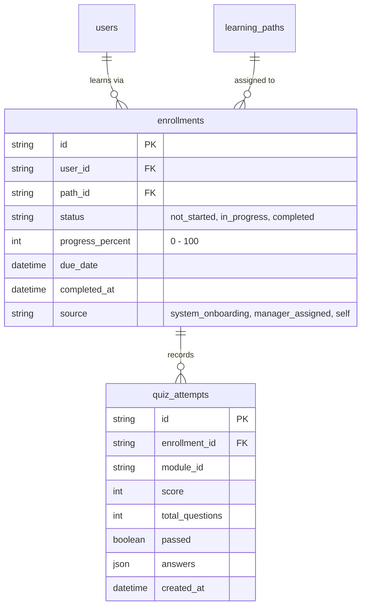

# System Design Specification: Learning Path Assignment & Progress Tracking
**Project:** SkillSprint AI – Dual-Pipeline AI Document Verification System  
**Track:** TechWiz 7 – Generative AI Powerplay Track  
**Author:** Pham Tan Tai (AI-assisted, see `AI_USAGE.md`)  

---

## 1. System Objectives

This specification defines the server-side architecture for managing employee curriculum assignments, learning progression, and completion verification:

1. **Individual Enrollment Records:** Every curriculum assigned to an employee persists as an independent server-side enrollment entity (`enrollments` table), recording start status, progress percentage, completion timestamp, and due dates.
2. **Automated Onboarding Assignment:** New Hire Onboarding paths are automatically assigned to newly provisioned employees matching the target department and position.
3. **Targeted Career Promotion Assignment:** Career Promotion paths support elective self-enrollment or direct managerial assignment with customizable completion deadlines.
4. **Server-Side Progress & Assessment:** Lesson completions, operational task checks, and quiz evaluations are processed and scored on the server, guaranteeing evaluation integrity.

---

## 2. Data Model & Database Architecture

---

## 3. Assignment & Enrollment Rules

### 3.1. Automatic Onboarding Assignment
- When a New Hire Onboarding path is published to a department and/or position, the system automatically creates an `enrollment` record for all existing employees in that role who have not yet completed onboarding.
- When an employee registers via an invitation link or is provisioned from a parsed CV, active onboarding paths for their assigned role are immediately attached with an initial status of `not_started` and a default 90-day due date.

### 3.2. Self-Directed Exploration & Elective Enrollment
- Employees can browse published curricula via the `/employee/explore` portal.
- Elective enrollments are tagged with `source = "self"`, operate without mandatory deadlines, and do not override corporate onboarding mandates.

---

## 4. Server-Side Progress Calculation

Progress percentage is calculated dynamically based on total required learning components:

$$\text{Progress} = \frac{\text{Completed Lessons} + \text{Completed Tasks} + \text{Passed Quizzes}}{\text{Total Lessons} + \text{Total Tasks} + \text{Total Quizzes}} \times 100\%$$

- **Lessons:** Marked completed via `POST /me/enrollments/{path_id}/lessons/{lesson_id}`.
- **Tasks:** Toggled via `PUT /me/enrollments/{path_id}/tasks/{task_id}`.
- **Quizzes:** Graded server-side via `POST /me/enrollments/{path_id}/quizzes/{module_id}`. A passing score of ≥ 70% is required to mark the quiz item complete.
- **Completion & Certification:** Reaching 100% progress transitions the enrollment status to `completed`, records `completed_at`, and unlocks the exportable digital certificate.
