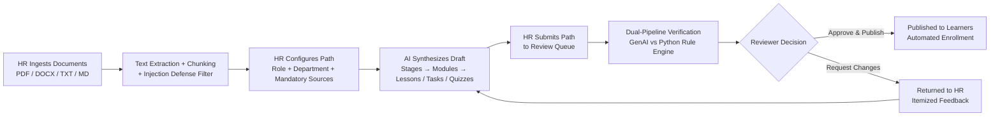

# SkillSprint AI — Frontend: Features, User Flows & Change Log
**Updated:** September 26, 2026 · **Fullstack Developer:** Pham Tan Tai · **Source:** `frontend/`

---

## 1. Product Overview

SkillSprint AI is an intelligent curriculum generation and verification platform designed to transform internal corporate documentation into structured, source-grounded **learning paths**:

- **HR Specialists** upload internal policies, SOPs, handbooks, and job descriptions (PDF, DOCX, TXT, MD/MARKDOWN, CSV).
- **Generative AI** synthesizes hierarchical learning paths comprising stages, modules, grounded lessons, practical tasks, and server-graded quizzes.
- **Paths support two core tracks:** **New Hire Onboarding** (foundational company orientation and role onboarding) and **Career Promotion** (advanced professional competencies).
- **Content Reviewers** audit and verify every synthesized curriculum before publication to employees.

### Role Responsibilities

| Role | Core Responsibilities | Workspace Route |
| :--- | :--- | :--- |
| **System Admin** | User account management, CV ingestion, read-only system-wide audit oversight | `/admin/*` |
| **HR Specialist** | Document ingestion, position requirements configuration, path generation, revision, submission | `/hr/*` |
| **Content Reviewer** | Path verification: knowledge accuracy, prerequisite sequencing, role relevance; approval, rejection, or direct editing | `/reviewer/*` |
| **Employee (Learner)** | Study assigned paths, open source citations in an inline split viewer, perform operational tasks, complete quizzes | `/employee/*` |

---

## 2. End-to-End User Flow

---

## 3. Key Feature Specifications

### 3.1. Document Repository & Ingestion (`/hr/documents`)
- **Multi-Format Ingestion:** Accepts PDF, DOCX, TXT, MD/MARKDOWN, and CSV files up to 25MB.
- **Client & Server Validation:** Validates magic bytes, enforces SHA-256 deduplication, checks structural section headings, and strips prompt injection payloads.
- **Lifecycle Tracking:** Visual indicators for `active`, `superseded`, `expired`, and `upcoming` policy versions.

### 3.2. Learning Path Synthesis (`/hr/paths/create`)
- **Role Requirement Matrix Integration:** Automatically locks and selects mandatory policy documents based on the selected job position.
- **Curriculum Duration Options:** Tailored pacing for 1-week (Day 1 / Week 1), 30-day, or 90-day onboarding timelines.
- **Real-Time 6-Stage Progress Monitor:** Live telemetry reporting analysis, structural planning, module synthesis, quiz generation, coverage calculation, and final assembly.

### 3.3. Reviewer Verification Workspace (`/reviewer/queue`)
- **Dual-Pipeline Comparison Matrix:** Side-by-side verification table highlighting field-level agreement between GenAI outputs and Python ground truth.
- **Granular Feedback & Inline Annotations:** Attach feedback comments to specific modules, lessons, or tasks.
- **Reviewer Override:** Reviewers can approve paths with warnings, provided an explicit, auditable justification (≥ 10 characters) is logged to the immutable audit trail.

### 3.4. Interactive Learner Portal (`/employee/dashboard`)
- **Active Curriculum Tracking:** Progress bars, due date countdowns, and overdue alerts.
- **Integrated Source Split Viewer:** Clicking any citation opens the exact source document at the relevant page (`#page=N`) side-by-side with lesson content.
- **Server-Graded Quizzes:** Multi-choice examinations scored securely server-side, preventing client-side inspection.
- **Completion Certification:** Unlocks an exportable digital certificate upon achieving 100% path completion.

---

## 4. Internationalization Architecture

The interface provides 100% bilingual parity across English and Vietnamese:
- Core engine: Custom reactive `LanguageContext` managing active locale state in `localStorage`.
- Translation helpers: `t(key, variables)`, `tv(object, field)` for localized document titles.
- Total dictionary keys: 1,030+ keys per language with zero missing or untranslated entries.
