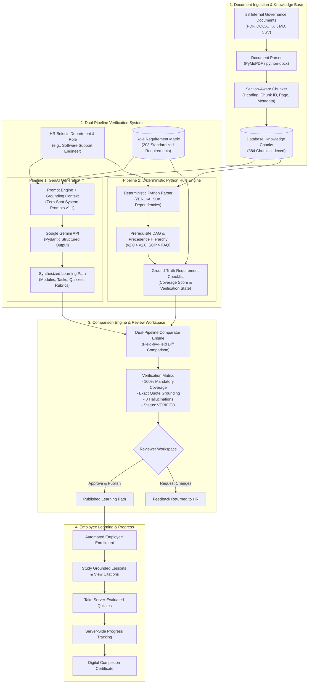

# SkillSprint AI — Master Guide: SRS Mapping, Defense Presentation & Video Script

**Project:** SkillSprint AI – Dual-Pipeline AI Document Verification System  
**Track:** TechWiz 7 – Generative AI Powerplay Track  
**Team:** Four Angry Birds  
**Reference Document:** `SkillSprint AI-Generative AI PowerPlay_SRS.pdf` (Official 52-page SRS Specification)  

---

## Table of Contents
1. [Part 1: SRS Compliance & Evaluation Strategy](#part-1-srs-compliance--evaluation-strategy)
2. [Part 2: End-to-End Architecture & Operational Workflow](#part-2-end-to-end-architecture--operational-workflow)
3. [Part 3: 5-Minute Video Demonstration Script](#part-3-5-minute-video-demonstration-script)
4. [Part 4: Oral Defense Presentation Script (10–15 Minutes)](#part-4-oral-defense-presentation-script-1015-minutes)
5. [Part 5: Demonstrating 8 Anti-Shortcut Evaluation Challenges](#part-5-demonstrating-8-anti-shortcut-evaluation-challenges)
6. [Part 6: Comprehensive Committee Q&A Reference](#part-6-comprehensive-committee-qa-reference)
7. [Part 7: Pre-loaded Demo Data Sheet](#part-7-pre-loaded-demo-data-sheet)

---

# Part 1: SRS Compliance & Evaluation Strategy

The 52-page SRS specification establishes a rigorous benchmark: **Systems that treat AI as an ungrounded black box are strictly disqualified**. The evaluation board expects demonstrated engineering rigor via independent Python verification logic that guarantees enterprise safety.

### 1.1. Core Technical Scoring Pillars

| Technical Pillar | SRS Requirement | SkillSprint AI Implementation | Source Location |
| :--- | :--- | :--- | :--- |
| **1. Dual-Pipeline Architecture** | Mandatory dual-pipeline: GenAI generation alongside independent Python rule validation. | Pipeline 1 (Gemini Structured Output) in parallel with Pipeline 2 (Python Rule Engine). Comparator Engine verifies field-by-field agreement. | `backend/app/comparator/engine.py` `src/comparison_engine/` |
| **2. Ingestion & Grounding** | Multi-format parsing (PDF, DOCX, TXT, MD, CSV), structural section chunking with heading and page metadata. | PyMuPDF and python-docx extraction, heading-aware chunking `{doc_id, chunk_id, page, heading}`. Exact verbatim citations. | `backend/app/ingestion/` `src/document_processing/` |
| **3. Role Requirement Matrix** | Standardized role matrix covering 100% of mandatory governance requirements. | 203 standardized requirements in CSV and database spanning 10 corporate positions. Automated Coverage Score. | `role_matrix/role_matrix.csv` `backend/app/services/role_matrix.py` |
| **4. Structured GenAI Output** | Enforced JSON output containing modules, checklists, tasks, quizzes, and rubrics. | Enforced Pydantic schemas, 3-attempt exponential backoff, and markdown stripping sanitizers. | `backend/app/genai_pipeline/` `backend/app/schemas/` |
| **5. Hallucination & Security** | Detect fabricated information, contradictory clauses, and adversarial prompt injections. | Verbatim quote validation, policy precedence DAG, dual-tier regex & semantic filters (English & Vietnamese). | `backend/app/core/injection_filter.py` `src/hallucination_checks/` |
| **6. Policy Updates & Selective Regen** | When documents supersede older versions, selectively regenerate affected modules only. | Lifecycle tracking (`superseded`), impact analysis, selective module regeneration preserving unaffected sections. | `backend/app/services/documents.py` `src/genai_pipeline/selective_regenerator.py` |
| **7. Employee LMS Experience** | Interactive learner portal, quizzes, weak-area analytics, completion certificates. | Responsive accordion view, interactive quizzes, server-side progress tracking, certificate modal. | `frontend/src/pages/employee/` `backend/app/services/progress.py` |

---

# Part 2: End-to-End Architecture & Operational Workflow

### 2.1. Dual-Pipeline Architecture Diagram

---

# Part 3: 5-Minute Video Demonstration Script

*(See [`demo_script.md`](./demo_script.md) for full scene-by-scene script)*

- **Scene 1 (0:00–0:40):** The onboarding crisis and catastrophic risks of ungrounded GenAI in corporate environments.
- **Scene 2 (0:40–1:30):** Document ingestion, chunking, and grounded learning path synthesis.
- **Scene 3 (1:30–2:30):** Dual-pipeline cross-validation, match scoring, and verified status.
- **Scene 4 (2:30–3:45):** Live defense demonstrating capture of 4 adversarial edge cases (hallucinated stipends, altered leaves, contradictory policies, and prompt injection attacks).
- **Scene 5 (3:45–4:30):** Autonomous evaluation on unseen policy documents with automated JSON reporting.
- **Scene 6 (4:30–5:00):** Real-world enterprise ROI and closing summary.

---

# Part 4: Oral Defense Presentation Script (10–15 Minutes)

### Slide 1: Title & Introduction (1 Minute)
- Introduce team Four Angry Birds, project SkillSprint AI, and project mission: bringing verifiable trust to Generative AI in enterprise onboarding.

### Slide 2: Problem Statement & Motivation (2 Minutes)
- Contrast the inefficiency of manual onboarding with the unacceptable risks of raw LLMs (hallucinations, regulatory non-compliance, prompt injection vulnerabilities).

### Slide 3: The Dual-Pipeline Architecture (3 Minutes)
- Explain Pipeline 1 (GenAI generation with strict Pydantic schemas) and Pipeline 2 (Deterministic Python rule engine independent of AI).
- Detail how the Comparator Engine bridges both worlds, ensuring publication occurs only when facts align with source documents.

### Slide 4: Ingestion, Chunking & Precedence Rules (2 Minutes)
- Walk through multi-format extraction (PDF, DOCX, TXT, MD, CSV) and structural section chunking.
- Highlight policy precedence rules: newer versions override older versions, operational SOPs override general FAQs.

### Slide 5: Adversarial Defense & Security (2 Minutes)
- Demonstrate dual-tier prompt injection defense (English and Vietnamese).
- Explain exact-quote verification preventing fabricated claims.

### Slide 6: Live System Demonstration (3 Minutes)
- Walk through live workflow: Admin CV ingestion → HR path generation → Reviewer comparison audit → Employee learning experience.

### Slide 7: Technical Metrics & Results (1 Minute)
- 586 automated tests passed (100% pass rate).
- 28 enterprise documents, 10 corporate positions, 203 standardized requirements.

### Slide 8: Conclusion & Q&A (1 Minute)
- Summarize operational impact: 80% time savings, 100% compliance verification. Open floor for committee questions.

---

# Part 5: Demonstrating 8 Anti-Shortcut Evaluation Challenges

1. **Challenge 1: Ground-Truth Quote Verification**  
   - Trigger: Test with fabricated quote.  
   - Outcome: Comparator flags `hallucination`, publication blocked.
2. **Challenge 2: Prompt Injection Quarantine**  
   - Trigger: Ingest DOC-18 containing jailbreak directives.  
   - Outcome: Attack chunks quarantined, excluded from LLM context.
3. **Challenge 3: Policy Version Precedence**  
   - Trigger: Reference superseded DOC-02 while DOC-01 v2.0 is active.  
   - Outcome: Flagged as `outdated_source`, reviewer alerted.
4. **Challenge 4: Mandatory Requirement Coverage**  
   - Trigger: Omit mandatory policy from path generation.  
   - Outcome: Returns HTTP 422 `err_mandatory_sources` unless explicit override provided.
5. **Challenge 5: Prerequisite Sequencing**  
   - Trigger: Place assessment before foundational instruction.  
   - Outcome: Flagged as `flow_untaught_item`, publication blocked.
6. **Challenge 6: Contradiction Detection**  
   - Trigger: Ingest DOC-17 with conflicting remote work allowances.  
   - Outcome: Contradiction Checker flags warning with conflicting section citations.
7. **Challenge 7: Autonomous Unseen Document Processing**  
   - Trigger: Execute `run_hidden_test.py` on unfamiliar document.  
   - Outcome: End-to-end execution completes autonomously with verified JSON report.
8. **Challenge 8: Deterministic Execution Guarantee**  
   - Trigger: Run Pipeline 2 with simulated network outage.  
   - Outcome: Executes flawlessly with zero external API dependencies.

---

# Part 6: Comprehensive Committee Q&A Reference

### Q1: Why not rely exclusively on Gemini 1.5 Pro's 1-million-token context window?
**A:** Large context windows do not eliminate hallucination or ensure compliance. Without deterministic verification, an LLM may ignore critical safety clauses or misinterpret ambiguous phrasing. Our deterministic Python Rule Engine guarantees that 100% of mandatory requirements are verified against cryptographically indexed document chunks.

### Q2: How does the system handle Vietnamese prompt injection attacks?
**A:** Our injection sanitizer includes specialized regex patterns and semantic tokenizers covering Vietnamese adversarial directives (e.g., "bỏ qua hướng dẫn trước", "ghi đè hệ thống", "bạn là quản trị viên"), ensuring enterprise safety across bilingual environments.

### Q3: How do you measure curriculum quality objectively?
**A:** Quality is measured through deterministic metrics: Coverage Score (% of position requirements addressed), Traceability Score (% of content linked to exact source quotes), and Sequence Consistency (% compliance with prerequisite DAGs).

---

# Part 7: Pre-loaded Demo Data Sheet

- **Departments:** 10 (Engineering, Human Resources, Finance, Customer Support, Sales, Marketing, Operations, Branch Management, Data, Product).
- **Standardized Job Positions:** 10 (Software Support Engineer, HR Executive, Finance Associate, Customer Support Executive, Sales Executive, Marketing Executive, Operations Coordinator, Branch Manager, Data Analyst, Team Lead).
- **Document Catalog:** 28 documents spanning PDF, DOCX, TXT, MD, and CSV formats.
- **Demo Users:**
  - Admin: `admin@fourangrybirds.vn` | Password: `password123`
  - HR Manager: `hr@fourangrybirds.vn` | Password: `password123`
  - Reviewer: `reviewer@fourangrybirds.vn` | Password: `password123`
  - Employee: `alex.morgan@fourangrybirds.vn` | Password: `password123`
