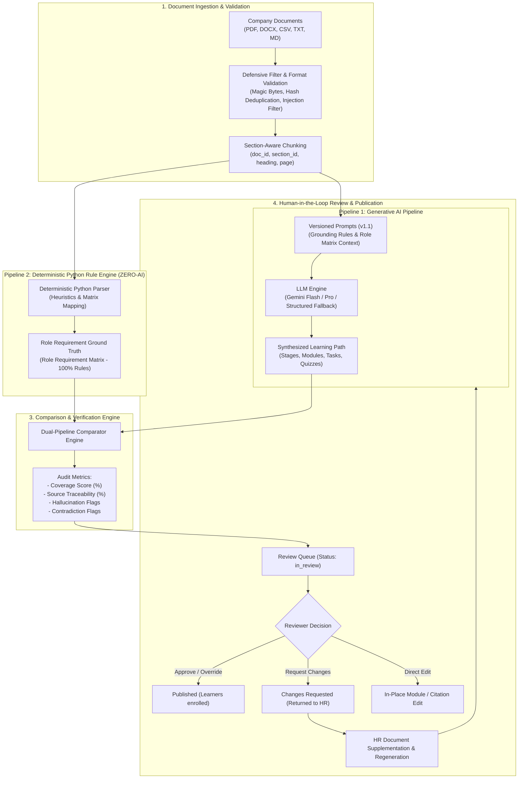

# SkillSprint AI — Prototype Workflow & System Design Specification
**Project:** SkillSprint AI – Dual-Pipeline AI Document Verification System  
**Competition:** TechWiz 7 – Generative AI Powerplay Track  
**Document Purpose:** Prototype Wireframe, System Workflow, and State Machine Specification.

---

## Table of Contents
1. [System Overview & Dual-Pipeline Architecture](#1-system-overview--dual-pipeline-architecture)
2. [End-to-End Operational Workflow](#2-end-to-end-operational-workflow)
3. [Role-Based Prototype UI Flows (RBAC)](#3-role-based-prototype-ui-flows-rbac)
   - 3.1. System Administrator Flow
   - 3.2. HR Specialist Flow
   - 3.3. Content Reviewer Flow
   - 3.4. Employee / Learner Flow
4. [Dual-Pipeline Comparison Matrix (Table 1 Prototype)](#4-dual-pipeline-comparison-matrix-table-1-prototype)
5. [Learning Path Lifecycle State Machine](#5-learning-path-lifecycle-state-machine)
6. [Adversarial Defense & Anti-Shortcut Measures](#6-adversarial-defense--anti-shortcut-measures)

---

## 1. System Overview & Dual-Pipeline Architecture


SkillSprint AI eliminates hallucination risks and guarantees 100% policy compliance in enterprise onboarding through its **Dual-Pipeline Architecture**:



---

## 2. End-to-End Operational Workflow

1. **Document Ingestion:** HR uploads enterprise policies, SOPs, and manuals. The ingestion layer checks magic bytes, runs SHA-256 deduplication, splits text by section headers, and filters out prompt injection attacks.
2. **Dual-Pipeline Generation:**
   - **Pipeline 1 (GenAI):** Gemini synthesizes lessons, tasks with completion criteria, and multiple-choice quizzes with strict exact-quote citations.
   - **Pipeline 2 (Python Rule Engine):** Evaluates coverage against the Role Requirement Matrix, checks prerequisite DAGs, and verifies chunk references deterministically with zero AI dependencies.
3. **Cross-Validation:** The Comparator Engine runs field-by-field verification, highlighting matches, warnings, or hallucinations.
4. **Human Review & Approval:** The Reviewer inspects verification metrics, adds inline feedback, or approves publication.
5. **Employee Execution:** Learners access assigned curricula, study source-backed materials, perform tasks, and take server-graded quizzes to earn completion certificates.

---

## 3. Role-Based Prototype UI Flows (RBAC)

### 3.1. System Administrator Flow (`/admin/*`)
- **User Management:** Create, update, deactivate, or delete user accounts. Assign corporate roles (`admin`, `hr`, `reviewer`, `employee`).
- **CV Ingestion & Account Creation:** Upload recruit CVs (PDF, DOCX, TXT, MD). Python extracts name, email, experience tier, and skills. Auto-generate accounts with temporary passwords and automated onboarding path assignments.
- **Audit Oversight:** Read-only visibility across all learning paths, verification reports, and system audit trails.

### 3.2. HR Specialist Flow (`/hr/*`)
- **Document Management:** Upload, inspect, re-process, or retire internal company documents. Real-time extraction progress and chunk visualization.
- **Path Generation:** Configure department, target position, and curriculum duration (7, 30, 90 days). View mandatory document locks enforced by the Role Requirement Matrix.
- **Live Progress Monitor:** 6-stage telemetry tracking analysis, structural planning, module synthesis, quiz formulation, coverage scoring, and final assembly.
- **Revision & Submission:** Inspect synthesized drafts, edit content inline, and submit to the Review Queue.

### 3.3. Content Reviewer Flow (`/reviewer/*`)
- **Review Queue:** Triage pending learning paths awaiting audit.
- **Dual-Pipeline Comparison View:** Side-by-side verification table highlighting field-level agreement between GenAI outputs and Python ground truth.
- **Granular Actions:** Approve & Publish, Request Changes with inline comments, Direct Edit, or Override with required audit justifications.

### 3.4. Employee / Learner Flow (`/employee/*`)
- **Learner Dashboard:** View active and completed learning paths, progress bars, due dates, and overdue alerts.
- **Interactive Module Viewer:** Study grounded lessons, open original documents in an inline split viewer (`#page=N`), check off operational tasks, and complete server-evaluated quizzes.
- **Self-Directed Exploration:** Browse published department paths and self-enroll in elective curricula.
- **Certification Modal:** Unlock a personalized completion certificate upon reaching 100% path progress.

---

## 4. Dual-Pipeline Comparison Matrix (Table 1 Prototype)

| Requirement ID | Role | Required Source Document | Expected Python Rule | Synthesized GenAI Result | Field Comparison Status | Resolution Action |
| :--- | :--- | :--- | :--- | :--- | :---: | :--- |
| **R001** | Software Engineer | DOC-06 §5 | SLA: Incident report within 1 hour | Stated SLA: 1 hour | **Match (Verified)** | Auto-approved |
| **R012** | HR Executive | DOC-05 §3 | Explicit consent for employee data | Consent documented | **Match (Verified)** | Auto-approved |
| **R045** | Customer Support | DOC-07 §4.2 | Tier 2 escalation within 30 min | Stated SLA: 15 min | **Mismatch (Warning)** | Flagged for Reviewer |
| **R089** | Finance Associate | DOC-09 §3 | Receipts filed within 15 days | Stated SLA: 30 days | **Mismatch (Hallucination)** | Publication Blocked |

---

## 5. Learning Path Lifecycle State Machine

```
[Draft] ──(Submit)──> [In Review] ──(Approve)──> [Published] ──(Archive)──> [Archived]
  ▲                        │
  └───(Request Changes)────┘
```

- `draft`: Editable by HR. AI-assisted synthesis or deterministic fallback draft.
- `in_review`: Locked for Reviewer evaluation and dual-pipeline audit.
- `changes_requested`: Returned to HR with itemized feedback comments.
- `published`: Immutable. Automatically enrolled to target department/role learners.
- `archived`: Retired curriculum. Historical progress records preserved.

---

## 6. Adversarial Defense & Anti-Shortcut Measures

1. **Dual-Tier Prompt Injection Sanitizer:** Scans document content and HR prompts for adversarial strings in both English and Vietnamese. Flagged chunks are omitted from model contexts.
2. **Deterministic Exact-Quote Verification:** AI claims must map verbatim to source chunk text in the database. Synthetic or paraphrased quotes trigger immediate hallucination flags.
3. **Policy Precedence Resolution:** Conflicting policies are resolved using deterministic DAG rules (newer version overrides older version, SOP overrides general FAQ).
4. **Append-Only Audit Trail:** Every status change, edit, review override, and publication is recorded with timestamp and user ID.
